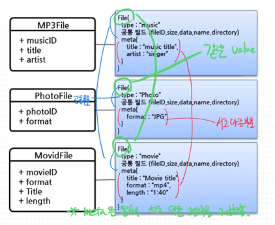

# NoSQL 
## 클라우드
- 물리적인 서버를 논리적인 서버로 추상화한 개념  
 ▶︎▹ 초기비용 낮음  
 ▶︎▹ 다양한 기기 단말기로 사용 가능  
 ▶︎▹ 접근성 좋음  

## 요즈음 데이터의 특징  
- 대규모, 단순한 형태 ( ex SNS의 경우 대용량의 데이터가 발생하지만 단순한 형태이다.)  
 ▶︎▹ 대규모 데이터이므로 관계형 데이터(RDBMS) 로는 저장하는데 문제가 있다.

## CAP이론
>C – consistency ( 일관성 )  
>A - Availability ( 가용성 )  
>P – Partitioning( 부분 결함 용인)  

 ▶︎▹ 모든 시스템은 이 중 2가지만 만족할 수 있다.  
 ▶︎▹ NoSQL 는 (C or A) & P를 만족한다.

## NoSQL ( Not Only SQL)
 ▶︎▹ 기존 RDBMS 의 단점을 보완해주는 형태  
 ▶︎▹ Foreign key로 정의 및 join 등의 관계 연산을 하지 않는다.  
 ▶︎▹ RDBMS와 는 다르게 스키마가 유동적이다.( 데이터를 분산해서 저장, 데이터를 상호 복제 )   
 ▶︎▹ ID로 사용하는 Key는 String으로 타입 동일 , value는 어떤 타입이던 가능  
 ▶︎▹ CAP이론을 따른다.  
#### NoSQL의 종류  
###### Key / Value Store개념  
- Unique Key 하나에 Value를 가지고 있는 형태  
- 저장 및 조회 기능만 가지고 있다.  
###### Ordered Key/Value Store 개념  
- Key 안에 ( column : value , column : value …)로 구성됨  
###### Document Key/Value Store 개념(MongoDB)  
- 저장되는 Value 타입으로 Document  라는 구조화된 데이터 타입 (JSON, XML, YAML …)  
 ▶︎▹ ```USER : { name : “jeonka”, age : “26” }```

#### NoSQL 설계시 주의사항
-	내가 가지고 있는 질문을 기준으로 모델링 한다  
- 데이터 설계 이전에 먼저 쿼리 및 성능을 정의한다.  
- 도메인 모델 분석 > 쿼리 결과 도출 > 테이블(데이터 저장 모델) 설계  
- 별도의 보안 체계를 마련? 인프라에 대한 디자인을 같이 해야함 ?  
- Join 연산 대부분 불가능 / 데이터를 여러 서버에 분산시킴  
- 모든 데이터 저장(많은 데이터 저장)을 위해서는 NoSQL 을 사용해야 한다.  

▶︎▹  Sorting, Grouping, Join 연산을 제공하지 않기 때문에 GET/PUT 으로만 데이터 처리가 가능하도록 모델을 재정의 한다.  
###### 비 정규화 = 데이터 중복 허용 
   ▶︎▹ 쿼리 수행 복잡도 낮아짐, 쿼리당 I/O(성능), 쿼리 데이터 사이즈 낮아짐.  
   ▶︎▹ 전체 데이터 사이즈(용량)가 올라감  
###### Aggregates 
   ▶︎▹ 유연한 스키마  
   ▶︎▹ File 이라는 테이블로 여러 데이터를 커버 가능  
   
###### Application Side Joins
- 어쩔 수 없이 Join 대상 데이터에 대해 비 정규화, 어그리게이션을 수행할 때 문제가 발생하는 경우  
    ex i.	Join 대상 데이터가 다대다 ( N:M) 관계  
       ii.	Join 대상 데이터의 수시 변동  
       ▶︎▹  결국 Join 을 해야한다.  
- 해결 방안  
i.	변경이 잦은 데이터는 RDBMS에서 구현을 해야한다.  
ii.	각 데이터를 NoSQL 에서 Select 를 한 후 Application에서 Join한다.  
    ▶︎▹  Application Side Join  

## NoSQL 모델링 주요 패턴  
>Atomic Aggregates  
>Enumerable Keys  
>Dimensionality Reduction  
>Index Table  
>**Composite Key Index**  
>Aggregation with Composite Keys  
>**Inverted Search – Direct Aggregation**  

#### Composite Key
- 하나 이상의 필드를 deliminatior를 이용하여 구분지어 사용하는 방법  
  ▶︎▹ Ex ) windows:etc, windows:programfile, windows:system32 …   
  ▶︎▹  window로 그룹핑  
#### Inverted Search Index 
- Value 를 key로 , key를 value로 하는 패턴   
   ▶︎▹ 검색엔진에서 많이 사용하는 방법    
   ▶︎▹ ex) key: URL, value : 문서 내에서 추출한 단어    
   ▶︎▹ 검색 시 두 값을 invert 한다.( 동적으로 만든다 )    
#### 계층 데이터 구조 모델링 패턴 ( = Tree )  
- Tree Aggregation  
 ▶︎▹ 트리 구조 자체를 하나의 value 에 저장하는 방법  
 ▶︎▹ JSON or XML 등을 이용하여 Tree 구조를 정의한다.  
 ▶︎▹ Tree 자체가 크지 않고, 변경이 많이 없는 경우에 적합  
1.	 
-	Materialized Path  
i.	Tree 구조를 테이블에 저장할 때, Root에서부터 현재 노드까지의 전체 경로를 key로 저장하는 방법  
ii.	특정 노드의 하위 트리를 한번에 가져오기 쉽다.  
1.	 
 
## 모델링 순서
###### 1.	도메인 모델 파악  
 ▶︎▹ 개체 파악, 개체간 관계 분석  
 ▶︎▹ ER Diagram  
###### 2.	쿼리 결과(데이터 출력 형태) 디자인  
 ▶︎▹ 도메인 모델 기반으로 어플리케이션에서 쿼리가 수행되는 결과값을 정함  
 ▶︎▹ 출력 형식 기반으로 필요 쿼리 정의  
 ▶︎▹ 출력 데이터 기반 테이블 정의 ( RDBMS 의 설계 방식과는 반대 )  
###### 3.	패턴을 이용한 데이터 모델링  
 ▶︎▹ 위 에서 언급한 패턴을 기반으로 데이터 모델 재정의  
###### 4.	기능 최적화  
 ▶︎▹ A 테이블이 B 테이블에 의존적이며 변경이 적고 개수가 적으면,  A를 B의 컬럼으로 포함시킨다.  
 ▶︎▹ 분류에 따른 출력을 위해서는 secondary index를 만든다.  
###### 5.	NoSQL 선정 및 테스트  
 ▶︎▹ 부하테스트, 특성 분석, 안정성/확장성 테스트 수행  
 ▶︎▹ 경우에 따라서는 여러 개의 NoSQL 을 복합하여 사용  
 ▶︎▹ 상황에 따라서는 RDBMS와 혼용하거나 다른 NoSQL 과 연동   
###### 6.	선정된 NoSQL에 최적화 및 하드웨어 디자인  
 ▶︎▹ UI/UX 등…

``` 
- 메모리 맵 형태의 파일 엔진 DB  
 ▶︎▹ 메모리 크기가 성능을 좌우  
 
- 쌓아놓고 삭제가 없는 경우가 적합 
 ▶︎▹ 로그 데이터, 이벤트 참여 내역, 세션 등..  
 ▶︎▹ 트랜잭션이 필요한 금융, 결제, 회원정보 등 은 부적합.   
 ▶︎▹ RDBMS  
```
